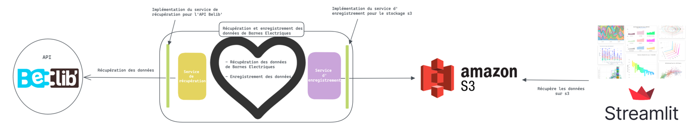

# Webinar Python borne Electrique

Dans ce dépôt nous pouvons retrouver le code permettant de récupérer les données sur l'api Belib' (stations de bornes
électriques pour voiture).

## Vue globale de l'architecture réalisée

+ Des tableaux de bord, pour afficher des Kpis sur les données de bornes électriques, vous pouvez retrouver le code dans 
[app.py](application/exposition/streamlit/app.py) 
+ Un traitement de récupération des données Bélib' et enregistrement sur un bucket s3

## Todo qui a servi pour développer 

[TODO APPLICATION](application/README.MD)

## Todo qui a servi pour packager 

[TODO INFRASTRUCTURE](infrastructure/README.MD)