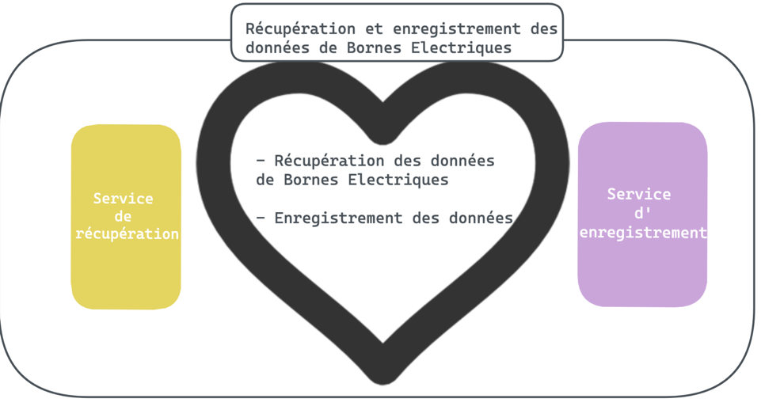
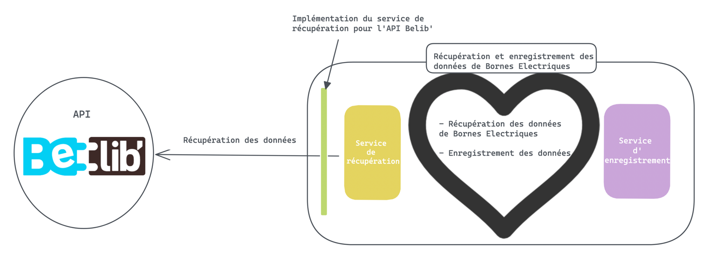
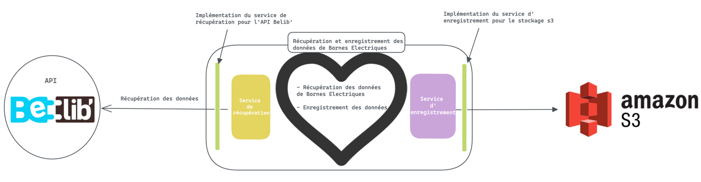

## Todo qui a servi pour développer 

- [ ]  Créer un usecase : RecuperationEtEnregistrementDonneesBorneElec
    - Doit appeler Le service de récupération : RecuperationDonneesBorneElec
    - Doit appeler Le service d'enregistrement : EnregistrementDonneesBorneElec
    - 💡 Récupération doit respecter le schéma suivant: 
   
| id  	| timestamp 	| latitude 	| longitude 	| adresse_station 	| statut 	| arrondissement 	|
|-----	|-----------	|----------	|-----------	|-----------------	|--------	|----------------	|
| str 	| datetime  	| float    	| float     	| str             	| str    	| str            	|

   
   

- [ ]  Implémenter un service de récupération : RecuperationDonneesBelib
    -  ⚠️ Attention tous les enregistrements n'ont pas tous les champs
  

- [ ]  Implémenter un service d'enregistrement : EnregistrementSurS3

